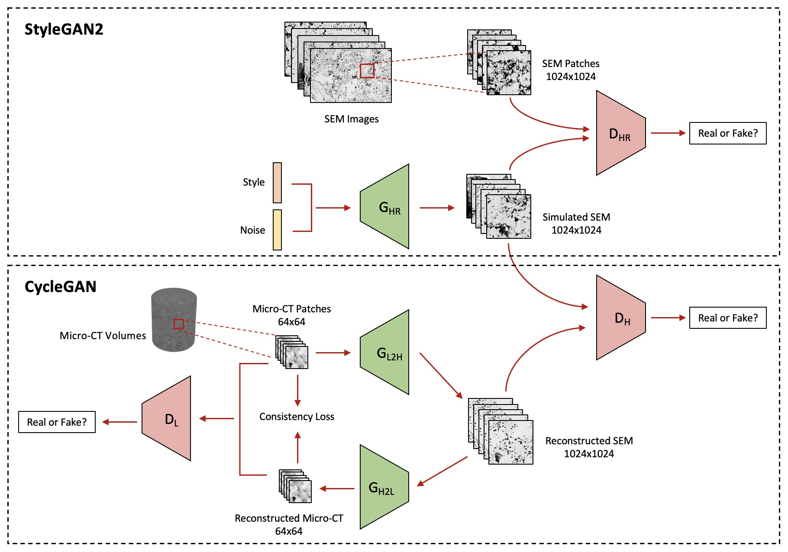

# MultiscaleDRPNet
This repo provides code for our paper <b>Multiscale fusion of digital rock images based on deep generative adversarial networks</b> ([Link](https://agupubs.onlinelibrary.wiley.com/doi/abs/10.1029/2022GL098342)).
* Authors: Mingliang Liu and Tapan Mukerji

 <b>The overall workflow of multiscale digital rock data fusion by StyleGAN2 and CycleGAN </b> 

 

## Abstract
Computation of petrophysical properties on digital rock images is becoming important in geoscience. However, it is usually complicated for natural heterogeneous porous media due to the presence of multiscale pore structures. To capture the heterogeneity of rocks, we develop a method based on deep generative adversarial networks to assimilate multiscale imaging data for the generation of synthetic high-resolution digital rocks having a large field of view. The reconstructed images not only honor the geometric structures of 3-D micro-CT images but also recover fine details existing at the scale of 2-D scanning electron microscopy images. Furthermore, the consistency between the real and synthetically generated images in terms of porosity, specific surface area, two-point correlation and effective permeability reveals the validity of our proposed method. It provides an effective way to fuse multiscale digital rock images for better characterization of heterogeneous porous media and better prediction of pore-scale flow and petrophysical properties.

## Datasets

- Download the datasets from https://doi.org/10.5281/zenodo.6420099
- LSK.zip includes 372 SEM images with size of 1024x1024 for the training of stylegan2-ada
- LR.tar.gz  includes 240,000 micro-CT sub-images with size of 64x64 for the training of cyclegan
- network-snapshot-stylegan.pkl is the saved model of stylegan2-ada after training. It is used for generating synthetic SEM images with size of 1024x1024 for the training of cyclegan. 

## Problems
If you find any bugs in the code or have trouble in running MultiscaleDRPNet in your machine, you are very welcome to [open an issue](https://github.com/theanswer003/MultiscaleDRPNet/issues) in this repository.
